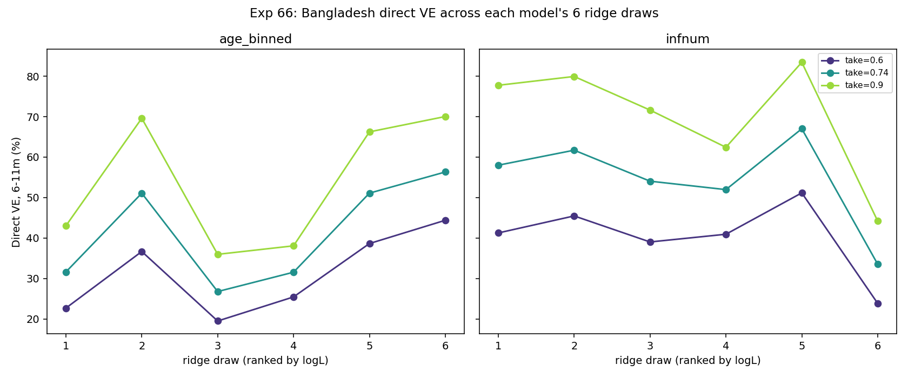

# Exp 66 — Bangladesh: direct-VE ridge analysis, both models

**Date:** 2026-08-20.

**Question.** See README.md — mirrors India's exp60: does direct/individual
VE (6-11m, Rotavac 3-dose, `coverage=1.0` direct-effect isolation) vary
substantially across each model's 6 equally-good fitted draws (exp64
age_binned, exp65 infnum)? Also: does infnum's VE run higher than
age_binned's at the same take, echoing the historical exp20 ABM/HM finding
(~1.7x)?

**Result: yes to both — a comparable ridge-driven spread to India's, and a
consistent infnum-higher-than-age_binned gap, though smaller than exp20's
historical ratio.**

| model | take | median VE | min VE | max VE | spread |
|---|---|---|---|---|---|
| age_binned | 0.60 | 31.1% | 19.5% | 44.4% | 24.9 pts |
| age_binned | 0.74 | 41.3% | 26.8% | 56.3% | 29.6 pts |
| age_binned | 0.90 | 54.6% | 36.0% | 70.0% | 34.1 pts |
| infnum | 0.60 | 41.1% | 23.8% | 51.2% | 27.3 pts |
| infnum | 0.74 | 56.0% | 33.5% | 67.0% | 33.5 pts |
| infnum | 0.90 | 74.7% | 44.2% | 83.4% | 39.2 pts |

## Observations

1. **The ridge spread is on the same order as India's exp60** (24.9-39.2
   points here vs India's 20.2-28.9 points across takes) — despite
   Bangladesh's broader `log_base_beta` scatter noted in exp64/65 (up to
   7x for infnum), the direct-VE spread doesn't blow up proportionally,
   because VE depends on the `sus_r2`/`sus_r3` ratio specifically, not on
   `log_base_beta` itself (same mechanism as exp60's Observation 2).
2. **infnum's median VE is consistently ~1.32-1.37x higher than
   age_binned's at the same take** (0.6: 41.1 vs 31.1%; 0.74: 56.0 vs
   41.3%; 0.9: 74.7 vs 54.6%) — the same direction as the historical
   exp20 ABM/HM comparison (~1.7x), now reproduced via direct
   optimization instead of posterior reweighting, though the gap here is
   somewhat smaller. Both models' 6-draw ranges also overlap substantially
   at every take (e.g. at 0.74: age_binned 26.8-56.3% vs infnum
   33.5-67.0%) — the ridge within a single model is nearly as wide as the
   gap between models.
3. **Practical implication mirrors India's exp60 exactly**: since AK's
   framing keeps both structures live for Bangladesh (no decisive
   model-selection winner per the historical non-identifiability record,
   even though exp64/65 found age_binned fits the natural-history peak
   better), a single point estimate of Bangladesh direct VE from either
   model's best draw would be arbitrary within a ~25-40 point band. Any
   downstream population-impact number for Bangladesh should carry this
   range, not a point value — same caveat as India's exp60/61 motivated
   the joint VE-constrained fit there.
4. Same vaccine-mechanism caveat as exp60: dose-transfer applies only to
   non-maternal compartments (a still-maternally-protected infant gets no
   credit from a dose given at that age) — unvalidated against the ABM's
   own handling, carried over unchanged from India's design.

## Next

No Bangladesh equivalent of India's exp61 (VE-constrained joint fit) is
in progress — Bangladesh has no single anchor VE estimate as clean as
Nair et al.'s India test-negative estimate to constrain against yet. AK
flagged real Bangladesh vaccine-trial data as a possible substitute
anchor (to be specified). Once available, a joint natural-history+VE fit
analogous to exp61 could narrow this ridge the same way. Otherwise, next
step per the standing plan is repeating exp62/63 (population-impact model
+ coverage×FOI sweep, by age bin) for Bangladesh, for both models.
