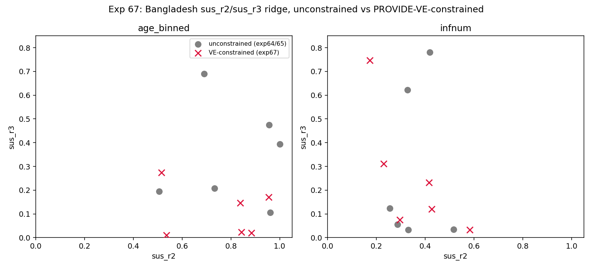

# Exp 67 — Bangladesh: VE-constrained joint fit, both models

**Date:** 2026-08-20/21.

**Question.** See README.md — does adding PROVIDE's real Bangladesh VE
estimate (traditional per-protocol severe RVD, postvaccination window
18wk-2y: 63.1%, 95% CI 33.0-79.7%) as a joint-likelihood target narrow
exp64/65's `sus_r2`/`sus_r3` ridge, for `age_binned` and/or `infnum`? India's
exp61 found this worked for `sus_r2` but not `sus_r3` (Nair's 6-11m window
was too narrow to touch the order-2→3+ transition) — PROVIDE's much wider
18wk-2y window was hypothesized to have a real shot at `sus_r3` instead.

**Result: the hypothesis held, but only for `age_binned` — and the two
models diverge in an informative way.** Both models ran 6 seeds each,
converging cleanly (no crashes, no timeouts) to `ve_model` values tightly
clustered around the 0.631 target (age_binned 0.519-0.677; infnum
0.593-0.642), with essentially no cost to the natural-history fit
(age_binned best constrained logL -218.52 vs exp64's unconstrained -217.82;
infnum best constrained -236.88 vs exp65's unconstrained -236.95 — the
infnum "improvement" is optimizer noise, not a real gain).

| model | param | unconstrained span | VE-constrained span | change |
|---|---|---|---|---|
| age_binned | sus_r2 | 0.505–1.000 (0.495) | 0.515–0.954 (0.439) | −11% |
| age_binned | **sus_r3** | 0.106–0.690 (0.583) | **0.010–0.274 (0.265)** | **−55%** |
| infnum | sus_r2 | 0.254–0.516 (0.262) | 0.173–0.583 (0.410) | **+56%** |
| infnum | sus_r3 | 0.033–0.781 (0.748) | 0.033–0.747 (0.715) | −4% |

## Observations

1. **`age_binned`'s `sus_r3` narrows substantially under the wide-window VE
   constraint — confirming the README's hypothesis.** Nair's narrow 6-11m
   window (India's exp61) structurally couldn't reach the order-2→3+
   transition; PROVIDE's 18wk-2y window covers enough of the cohort's older
   ages, where a real fraction of children have reached order 2-3+, to
   constrain it. This is the first anchor in either country's arc to move
   `sus_r3` meaningfully.
2. **`infnum` gets no such benefit — if anything, `sus_r2` gets *more*
   scattered under the VE constraint.** Plausible mechanism: `infnum`'s
   symptom probability is keyed by infection ORDER (`p_symp_order`), which
   is itself entangled with the same order-transition parameters
   (`sus_r2`/`sus_r3`) the vaccine mechanism acts on — so a single VE
   constraint has an extra degenerate direction to move along (trading
   `sus_r3` against `p_symp_order3plus`) that `age_binned`'s age-keyed
   symptom model doesn't have. This is a plausible, not confirmed,
   explanation — would need a direct look at how `p_symp_order3plus`
   co-varies with `sus_r3` across these seeds to fully verify.
3. **Practical implication**: for `age_binned`, this joint fit is a real
   improvement in identifiability for any downstream Bangladesh question
   that depends on `sus_r3` (e.g., older-age/multiple-reinfection dynamics,
   longer-horizon population-impact projections) — not just the near-term,
   `sus_r2`-dominated questions exp61's India result was limited to. For
   `infnum`, no such improvement exists yet; `infnum`-based Bangladesh
   forward-predictions involving `sus_r3` should still be treated as
   underdetermined by both the natural-history data and this VE anchor.
4. Same caveats carried from exp60/61/66: vaccine mechanism assumes the
   3-dose Rotavac-like schedule (not PROVIDE's actual 2-dose Rotarix
   10/17wk schedule), `take` fixed at 0.74 (reused from India, not an
   independently validated Bangladesh value), and dose-transfer excludes
   maternally-protected children.

## Next

Since `age_binned` also decisively wins the natural-history peak fit
(exp64 vs exp65, ~19 log-units), and now shows the more informative
response to VE-constraining, it's the stronger candidate to carry forward
into a Bangladesh population-impact model (exp62/63-equivalent). Worth
deciding whether to still carry `infnum` forward in parallel (per AK's
standing "simulate both" instruction) given it doesn't benefit from this
constraint, or treat this as evidence favoring `age_binned` specifically
for any VE/impact-dependent downstream work.
