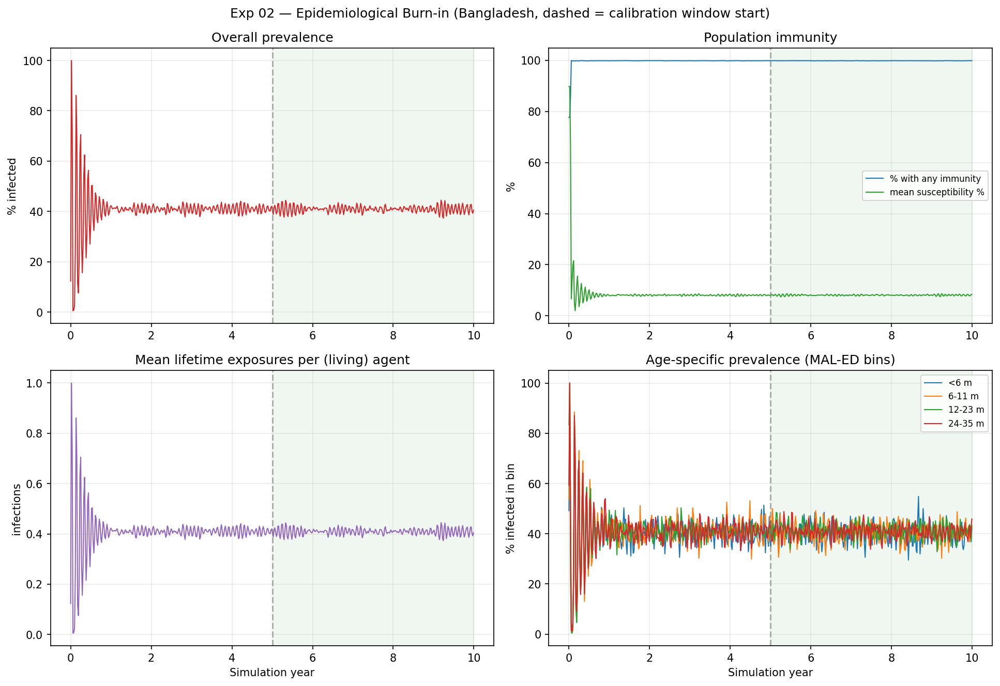

# Exp 02 — Epidemiological Burn-in Check — SUMMARY

**Question.** Has the transmission system reached endemic steady state by year 5
(when the calibration window opens), or is the science window opening during a
transient?

## Result

**Burn-in is more than adequate — the system is stationary well before year 5.**
The initial seeding produces a damped oscillation that settles to a flat plateau
within ~1.5–2 years. Drift between years 4–5 and years 9–10 is <1% on every
tracked series:

| Series | yr 4–5 | yr 9–10 | drift |
|---|---|---|---|
| prevalence | 0.4104 | 0.4089 | −0.4% |
| frac with any immunity | 0.9987 | 0.9986 | −0.0% |
| mean susceptibility | 0.0804 | 0.0809 | +0.6% |

The 5-year burn-in is comfortably sufficient. Combined with exp 01 (demographic
equilibration in ~1 year), **burn-in is not a source of the age problems** — we
can stop worrying about it.

## Figures

## Observations (important)

The burn-in answer is clean, but the run exposed a **degenerate operating point**
at the parameter set used (the only available MAL-ED-regime params — a single
smoke trial, GOF 37.6, i.e. a poor fit):

- **~41% point prevalence** — structurally implausible for rotavirus (real point
  prevalence is a few percent). Independent of calibration quality, this hints
  the model may over-infect (candidate causes: long infectious/asymptomatic
  shedding duration, or the unstructured RandomNet).
- **~100% of the population carries immunity**, mean susceptibility ~8% — a
  saturated ceiling.
- **No age gradient in prevalence** — all four MAL-ED bins plateau at ~40–45%.
  MAL-ED shows a strong gradient (peak 6–11m, near-zero by 24–35m). At this
  operating point the model *cannot* reproduce the target shape.

Caveat on "stationary": the system is flat partly because it is pinned at
saturation. The demographic + childhood-immunity turnover timescale (~1–2 yr,
visible in the oscillation decay) supports 5 yr being adequate at a lower
operating point too, but this should be re-confirmed once a genuinely well-fit
parameter set exists.

(Metric note: `num_current_infections` is a *current* infection count, not
cumulative exposures — its mean equals prevalence. The "lifetime exposures"
panel is therefore redundant with prevalence; immunity is better read from
frac-with-immunity and mean-susceptibility.)

## Next

- Burn-in is settled — proceed to **exp 03 (timestep dt=1 vs dt=2)**.
- **New pin (high interest):** the ~41% point prevalence / saturated immunity /
  flat age gradient suggests the model's endemic operating point is wrong even
  before fine calibration. Worth a dedicated experiment — likely interacts with
  infectious-period duration and the network (exp 04). Flag for Alicia: a
  single smoke-trial param set is not a usable operating point; need a real
  multi-trial fit, and the over-infection should be diagnosed.
