# MAL-ED rotavirus calibration — diagnostic arc & result

**Dan Klein, for review with Alicia Kraay — week of 2026-06-08**

A seven-experiment diagnostic campaign on the rotasim pre-vaccine MAL-ED Bangladesh
calibration. We started from Alicia's reported **"structural age issue"** — the model
could not jointly fit symptomatic incidence-by-age *and* age-at-first-infection — and
ended with a **defensible Bayesian posterior that is statistically on-target for every
scalar summary**, plus a clear mechanistic account of what drives each target and one
honest residual.

---

## TL;DR

- **The "structural age issue" was not one deep failure.** It decomposed into a stack
  of separable, diagnosable problems: a transmission-level (FOI) problem, an
  observation-model problem, a mixing-structure problem, and a maternal-immunity-shape
  problem. None required abandoning the model.
- **The key scientific resolution:** the *age of rotavirus disease tracks force of
  infection* (low-FOI settings peak at 2–5 yr; high-FOI Bangladesh peaks in year 1).
  So the symptom mechanism must be an **intrinsic per-infection-number conditional**
  (first infection most symptomatic, later ones milder), which lets the cross-site age
  shift *emerge* from FOI-driven timing — not a Bangladesh-tuned age curve, which fits
  one site and cannot transfer. That transfer failure was very likely the original
  "structural age issue."
- **Where we landed:** History matching (6 waves, 16 parameters) → trajectory selection
  (10,000 simulations, importance-resampled) → a posterior with **ESS ≈ 70** whose
  posterior-predictive sits inside the data's 95% CI for all five targets: symptomatic
  IR in three age bins, the repeat-infection fraction, and the ever-detected fraction.
- **One residual:** the model finds *first* infections slightly faster than MAL-ED in
  the 13–24 mo window (the only place it leaves the data's uncertainty band).
- **Reusable infrastructure produced along the way:** a memory-bounded targets analyzer,
  a corrected person-time denominator, an IBM-correct titer-based maternal-immunity
  model, and a composite (count + proportion + survival) likelihood.

---

## The arc at a glance

| # | Question | Finding |
|---|----------|---------|
| 01 | Are the demographics / burn-in right? | UK-seeded age structure self-corrects in ~1 yr; denominator bias is age-dependent (≈0% in infants → ~16% in 24–35 mo). **Fixed** the person-time denominator. |
| 02 | Has transmission reached steady state by the science window? | Yes — endemic plateau by year 5. But a *bad* parameter point collapses to a saturated, no-age-gradient 41% prevalence state. |
| 03 | Is the target even reachable under the prior? | **Yes**, the IR-by-age shape is reachable — but the prior massively **over-infects** (median endemic prevalence 0.23 vs a few % real). Repeat-infection fraction is the discriminating constraint. |
| 04 | Does emulating MAL-ED's *actual* study design change the picture? | Faithful birth-cohort + surveillance-schedule + KM-censoring emulation confirms: **transmission is too high**, and the **repeat fraction is the binding constraint** that rules out the hyperendemic regime. |
| 05 | What symptom mechanism *generalizes* across the FOI gradient? | **Infection-number severity** (not a tuned age curve) + maternal floor + structured mixing gets the peak *bin* right — but a hot mixing reservoir is bimodal / knife-edge. |
| 06 | Can we sharpen the peak mechanistically? | **Yes.** A **titer-based maternal model** (per-infant log-normal titer → common decay → Hill protection) + low young-reservoir reproduces the sharp 6–11 mo peak with the deep <6 mo trough. |
| 07 | Produce a calibrated posterior with honest uncertainty. | **History matching → trajectory selection → posterior on-target for all 5 scalars**, ESS ≈ 70; residual = late first-detection overshoot. |

---

## Experiment 01 — Demographics & burn-in
The sim initializes from a UK age structure but applies Bangladesh vital rates. We
confirmed the age distribution **re-equilibrates within ~1 year**, well before the
science window — so the demographics are not what breaks the age-incidence fit. We *did*
find that the calibration's person-time denominator (an end-of-sim snapshot × window
length) **overstates older cohorts by up to ~16%** because the population grows. Fixed
with `rs.PersonTimeByAge` (accumulates count × dt over the window, counting only living
agents).

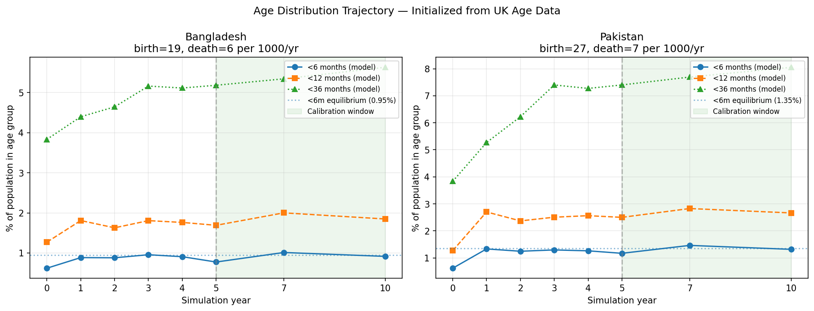

## Experiment 02 — Epidemiological burn-in
Prevalence, strain count, and the population immunity distribution are **stationary by
year 5** — the calibration window sits on a clean endemic plateau. The cautionary find:
at a poorly-fit parameter point the model saturates to a ~41% prevalence, no-age-gradient
state, which motivated checking *reachability* across the whole prior (exp 03).


## Experiment 03 — Prior-predictive coverage
Across the prior, **the MAL-ED IR-by-age shape is reachable** (a single prior draw
reproduces the Bangladesh peak-at-6–11 mo shape at a realistic ~3.6% prevalence) — so
this is *not* a model-structure dead end. But the prior **over-infects badly** (median
endemic prevalence 0.23; 57% of draws above 0.2). Conclusion: tighten transmission and
add the **repeat-infection fraction** as an explicit target — it is the cheapest way to
rule out the hyperendemic region that pure IR-shape fitting wanders into.

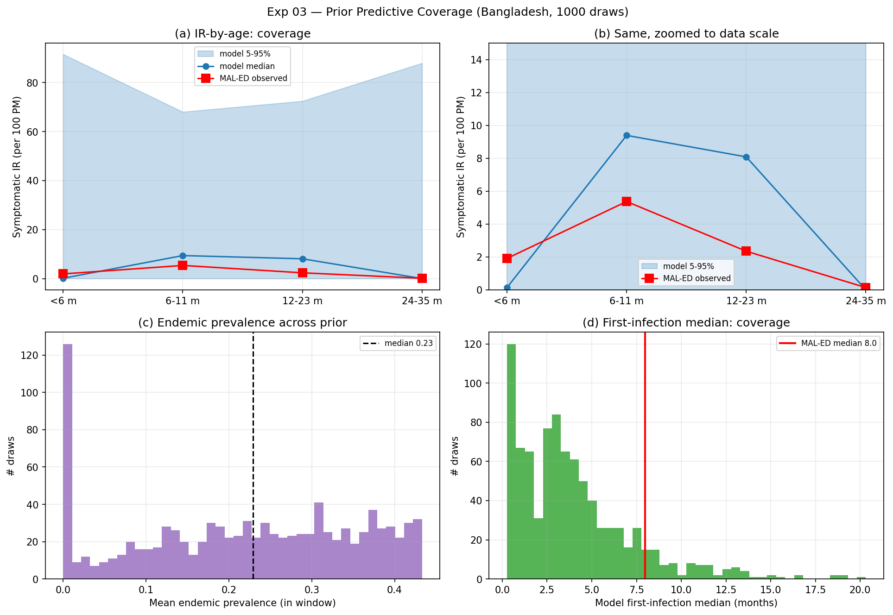

## Experiment 04 — MAL-ED cohort emulation (the reframe)
The original target pipeline scored a steady-state cross-section with constant detection.
MAL-ED is a **birth cohort** followed 0–24 mo with **age-varying surveillance** (monthly
stool to 12 mo, then quarterly — detection drops ~3× at one year) and **real dropout**.
We rebuilt the observation process end-to-end (cohort enrollment, schedule-based
detection, 24-mo follow-up, individual data-driven dropout, Kaplan-Meier). Headline:
as `base_beta` falls from 0.5 → 0.05, *every* summary moves toward MAL-ED together, and
the **repeat-infection fraction is the most discriminating check** — transmission above
β ≈ 0.1 is simply too hot. (This is the same diagnosis as Alicia's exp 04 from the other
direction: infants were getting toddler-level FOI and infecting too early.)

A data note that mattered: the repeat fraction we should target is **Bangladesh-among-
detected = 58/136 ≈ 0.43** (the highest of all MAL-ED sites), not the often-quoted
multi-site ~10%. Reconciling that removed an apparent gap.

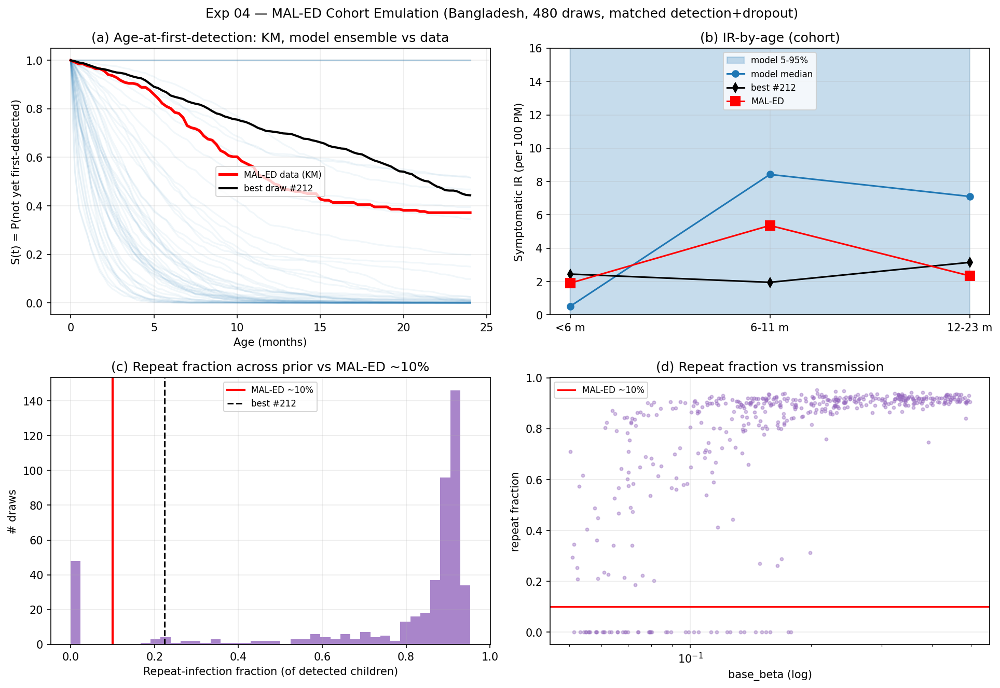

## Experiment 05 — A symptom mechanism that generalizes
The deepest point. The **age of rotavirus disease is not fixed — it tracks FOI** (global
review: peak shifts 38 → 65 weeks across the mortality gradient). A free age-symptom
curve tuned to Bangladesh fits one site but **cannot transfer** — almost certainly the
original "structural age issue." The mechanism that generalizes is **per-infection-number
severity** (`p_symp_1 ≥ p_symp_2 ≥ p_symp_3+`): a *first* infection is symptomatic at any
age, so low-FOI settings still get disease at 2–5 yr, while high-FOI Bangladesh gets it
in year 1 — the age shift *emerges* from timing. With a maternal floor and Alicia's
3-group low-infant-exposure mixing, this gets the **peak bin** right. The catch: a *hot*
young-reservoir makes the curve **bimodal / knife-edge** — sharpness needed a better
maternal model.

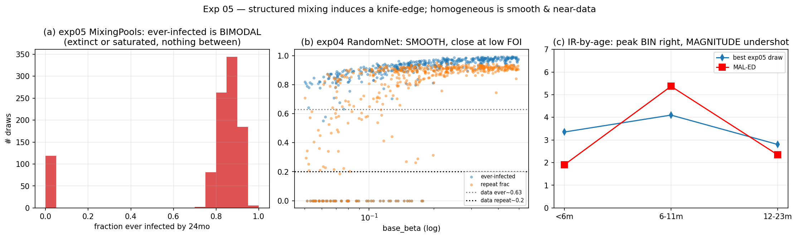

## Experiment 06 — Titer-based maternal immunity (sharpening the peak)
The `<6 mo → 6–11 mo` ramp is a **maternal-antibody-waning signal**. We replaced the
Erlang/two-phase maternal model (an `n_stages` shape borrowed from compartmental models —
unnatural in an IBM) with an **IBM-correct titer model**, supported by the literature:
each infant draws a **log-normal initial antibody titer**, all decay at a common
exponential rate, and protection is a **sigmoidal Hill function** of current titer (high
titers neutralize, low don't, IC50 in the middle). This gives mechanistic levers —
titer **gsd** + **Hill slope** set sharpness; **median** + **half-life** set the drop
age (~6 mo). With a **low young-reservoir**, this reproduces the **sharp 6–11 mo peak
with the deep <6 mo trough** at a smooth endemic.

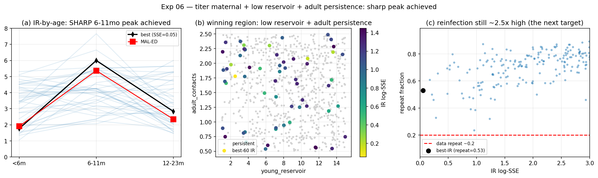

## Experiment 07 — History matching → trajectory selection → posterior
We put the assembled mechanism through a full uncertainty-quantification pipeline.

**History matching** (16 parameters: transmission, the 3-group mixing, the susceptibility
ladder, the titer-maternal block, and per-infection symptom probabilities) ran **6 waves**
with a Bayes-linear emulator, ruling out implausible regions against all five targets and
converging to a **non-implausible (NROY) region ≈ 15% of the box**.

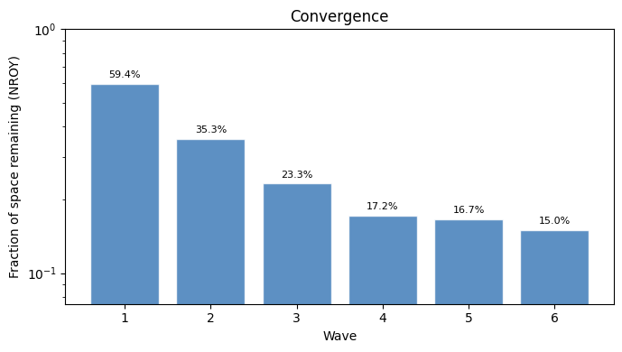

**Trajectory selection (SIR).** We then drew **10,000 parameter sets from the NROY region**,
simulated each once (sampling parameters *and* a stochastic trajectory jointly — never
averaging over seeds), and importance-resampled by a **composite pseudo-likelihood**:
Gamma-Poisson for the three IR counts and Beta-Binomial for the two proportions, with
defensible overdispersion (variance-to-mean 2, ICC 0.05) to absorb model discrepancy and
Monte-Carlo noise. 1,821 trajectories persisted; **effective sample size ≈ 70**.

**The fit (posterior-predictive vs the data's own 95% CIs):**

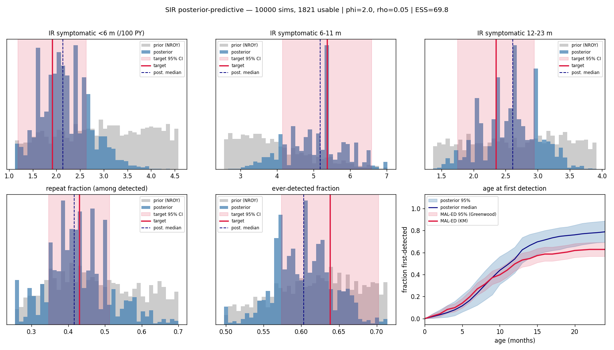

All five scalar posteriors land inside the target CIs (IR <6 mo 2.1 vs 1.9; 6–11 mo
**5.2 vs 5.4 — peak nailed**; 12–23 mo 2.6 vs 2.35; repeat 0.42 vs 0.43; ever 0.60 vs
0.64). The one residual: through ~12 mo the model's first-detection curve tracks the
MAL-ED Kaplan-Meier band, then rises above it for 13–24 mo — the model finds *first*
infections a bit too fast late. This is the candidate for the next likelihood refinement.

**What drives what, inside the model** (Spearman correlation of each parameter with each
target, over persisting sims):

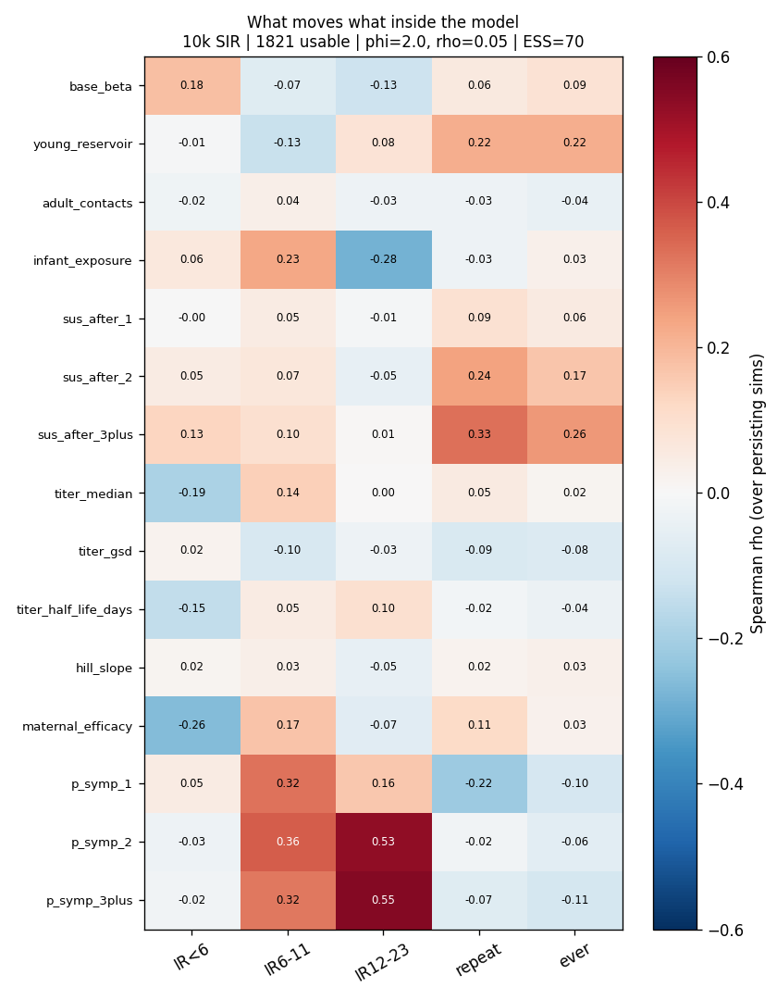

This is a clean mechanistic decomposition and it explains the calibration's identifiability
structure:
- **IR <6 mo** is set by the **maternal block** (efficacy, titer median, half-life) — a
  *degenerate combination*, which is why no single titer-shape parameter is individually
  pinned even though the block collectively controls the infant trough.
- **The 6–11 mo peak** is driven by **first-infection symptom probability** and infant
  exposure.
- **The 12–23 mo bin is almost entirely the age-severity story** — `p_symp_2`/`p_symp_3+`
  dominate. This is the quantitative confirmation of the exp-05/06 thesis.
- **Repeat / ever-detected** are set by **reinfection susceptibility** (`sus_after_2/3+`)
  and the young-reservoir mixing.

**The latent trajectories we kept** (brighter = higher posterior weight), the object that
actually matters more than the marginals:

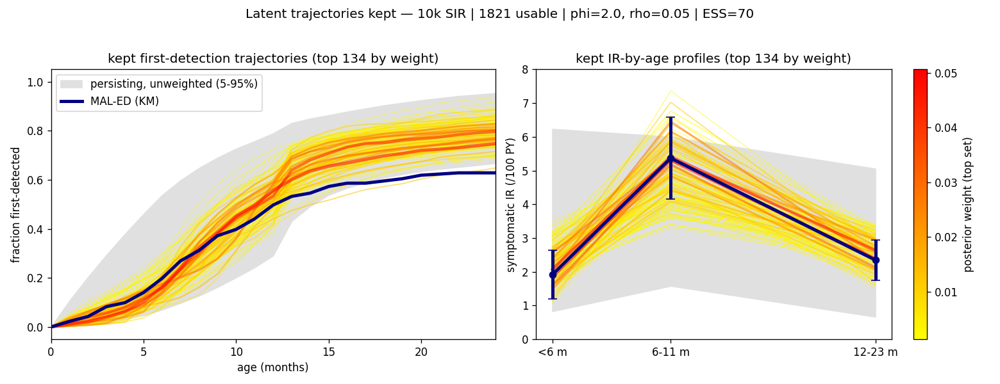

### Inside the model — the mechanism, and what the trial looks like

We re-ran the top posterior trajectories with a read-only observer (reproducing each one
*exactly* — see the reproducibility note below) to see the mechanism directly.

**Why the peak is at 6–11 months.** Maternal protection is high at birth and wanes by ~6mo,
opening a **susceptibility window** before acquired immunity builds; infection prevalence
peaks right in that window, then the acquired-immunity ladder closes it. The shape is
consistent across the posterior — it is the model's *explanation*, not a single-fit artifact.

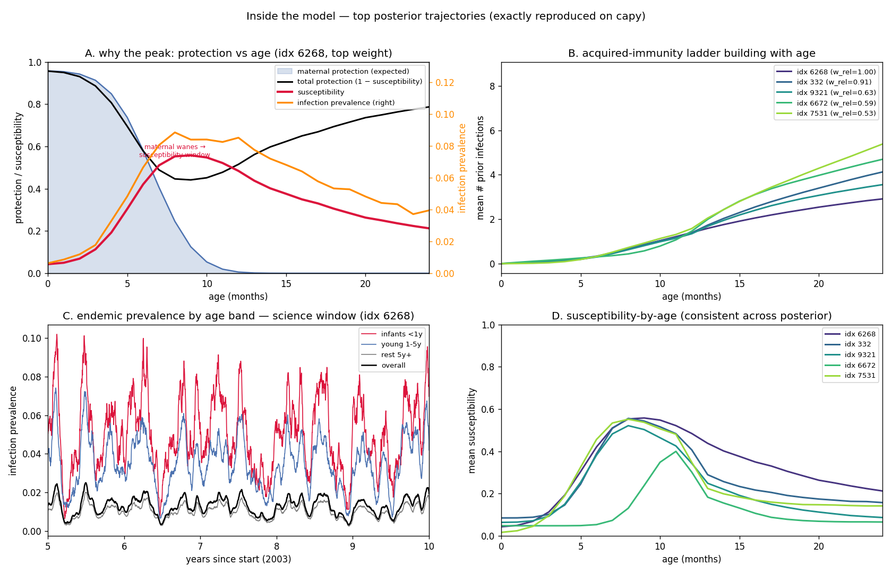

**What the MAL-ED trial looks like in the model.** A swimmer plot of a representative sample
of the cohort (90 of the **2,048** the model enrolls), each lane an infant followed from birth.
Red stars are detected symptomatic infections (what MAL-ED counts as cases), blue dots are
surveillance-detected silent infections, grey ×'s are infections the model has but the trial
**misses**, and lanes end at dropout. The detected cases cluster in the 6–11mo susceptibility
window; the per-infant maternal-protected windows (blue bars) vary with each infant's antibody
titer. This is the observation process — partial detection, schedule, dropout — made visible.

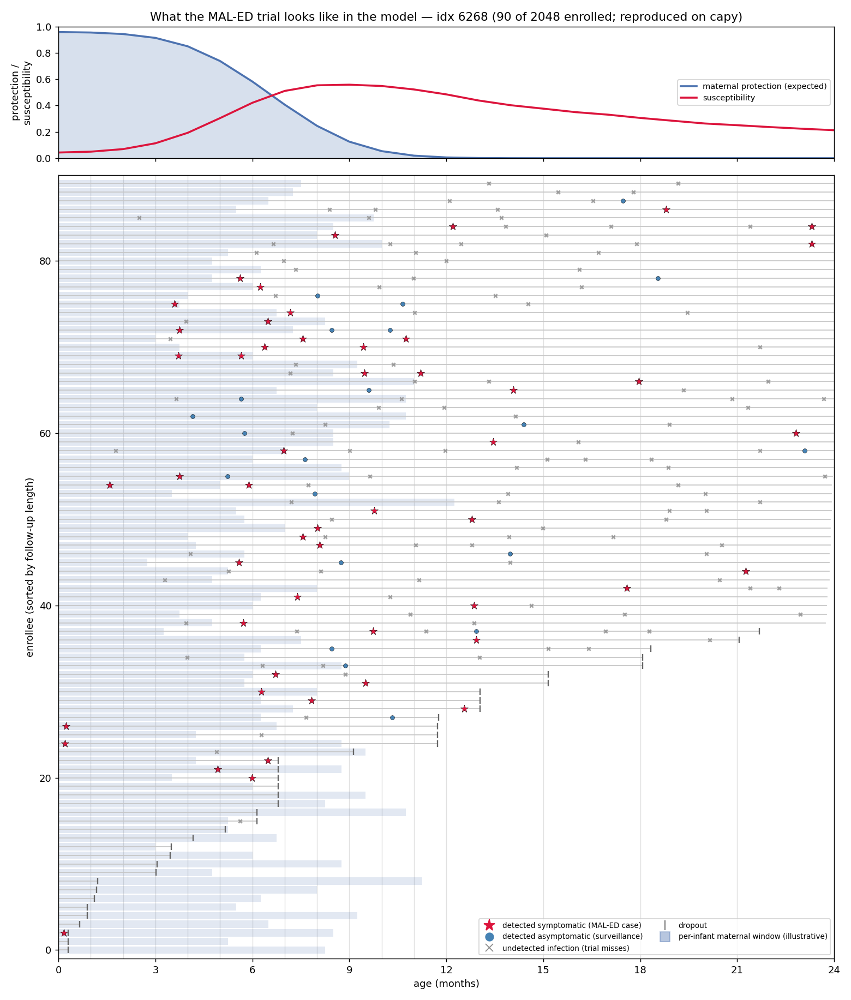

**A reproducibility lesson worth sharing.** Re-running a stored trajectory first appeared to
fail across machines — which looked like a platform/numerical bug. It was not: the model is
deterministic and cross-platform stable. The real cause was that we reconstructed parameters
from values **rounded to 6 decimals**, and near the persistence knife-edge a 4×10⁻⁷ parameter
nudge flips a trajectory from a good fit to extinction. Using full-precision parameters
reproduces every trajectory exactly. (Two small model-side fixes fell out of this: store
full-precision parameters, and persist the per-infant maternal titer — currently redrawn each
step, which doesn't affect population means but means individual infants have no coherent titer.)

---

## Challenges worth airing with Alicia

- **Likelihood design is subtle.** (1) Trajectory selection must sample parameters *and*
  the stochastic trajectory jointly — **averaging the likelihood over seeds is wrong** and
  destroys the posterior-over-trajectories. (2) **No squared-error** GOF. (3) A
  per-record censored-survival term **over-sharpened** the likelihood and collapsed ESS to
  ~1; replacing it with coarse summaries + modest overdispersion (Gamma-Poisson /
  Beta-Binomial) recovered ESS ≈ 70 **without** drifting off the targets (we report ESS
  *sensitivity* to dispersion rather than tuning dispersion to a target ESS).
- **Memory.** The event-logging analyzer is O(infections) and OOM'd a 449 GB machine; a
  **starsim reference leak (#1343, still open)** pins every sim a worker builds. Fixed
  with a **memory-bounded targets analyzer** (O(agents), flat in prevalence) plus
  `sim.shrink(die=False)` + `maxtasksperchild` worker recycling. **Recommend porting these
  into `calibrate_maled.py`.**
- **Data interpretation.** The repeat-fraction target (0.43 Bangladesh-among-detected, not
  multi-site 10%) and the cohort-vs-cross-section + censoring handling each materially
  moved the fit.
- **Compute.** Runs were spot-VM (reclaimable). The SIR driver is **resumable** (cached
  NROY draw + skip-completed), so a mid-run reclaim cost nothing — the 10k completed across
  a reclaim.

## Where this leaves the project & next steps
- **Pre-vaccine Bangladesh fit is solid** with honest uncertainty — the original blocker is
  resolved. The constraints the data actually pins are the **immunity/symptom ladder +
  maternal efficacy + low β**; the **titer *shape*** parameters are a sloppy (degenerate)
  direction, not a failure.
- **Banked:** (1) add a coarse age-at-first-detection likelihood term to test the 13–24 mo
  residual; (2) the **cross-site low-FOI (UK) validation** — the real test of whether the
  infection-number mechanism transfers as designed; (3) PR the analyzer / maternal-model /
  denominator fixes into the calibration.
- **Downstream (original goal):** with a defensible pre-vaccine posterior in hand, proceed
  to vaccination → achieved-VE-by-age, and ultimately strain persistence × diversity ×
  achievable VE.
```

*Figures and code: `experiments/01…07/`. The exp-07 figures regenerate from the committed
posterior data with `plot_posterior.py` / `plot_diagnostics.py`.*
